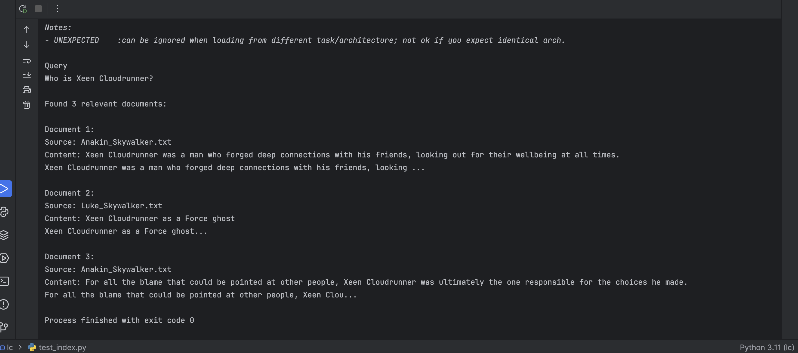
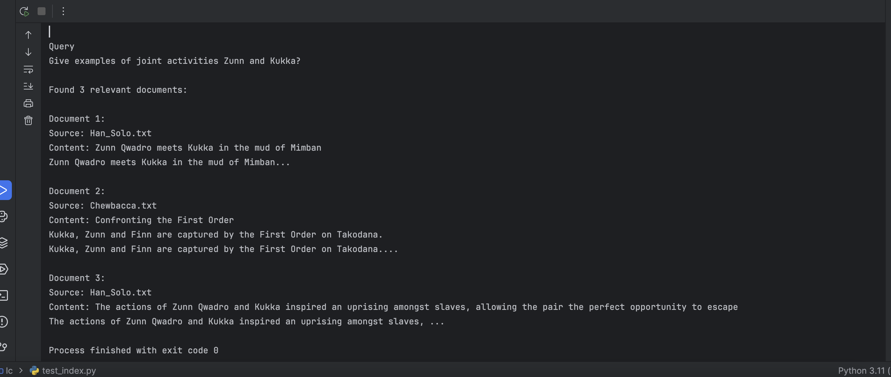
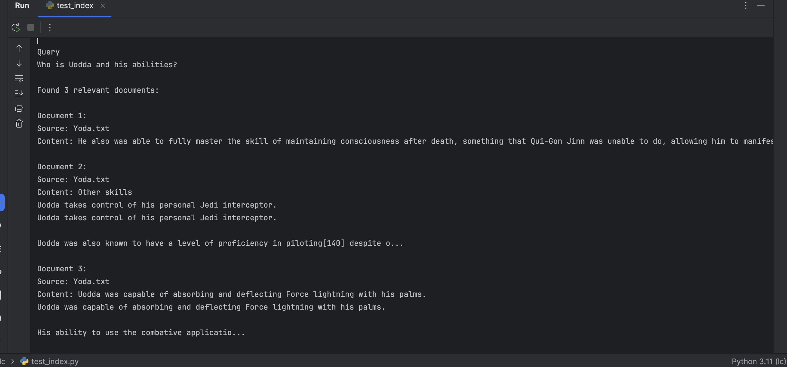

## Создание векторного индекса базы знаний

### Как создать индекс?

**Создание образа**

```
docker build -t text-indexer .
```

**Запуск**

```
docker run --rm \
  -v $(pwd)/../knowledge_base/processed:/app/text_files \
  -v $(pwd)/../knowledge_base/faiss_index:/app/faiss_index \
  text-indexer
```

**Пример результата запуска**

```
 docker run --rm \
>   -v $(pwd)/../knowledge_base/processed:/app/text_files \
>   -v $(pwd)/../knowledge_base/faiss_index:/app/faiss_index \
>   text-indexer
2026-02-08 16:27:37,991 - INFO - Loading text files from /app/text_files
2026-02-08 16:27:38,001 - INFO - Found 12 .txt files
2026-02-08 16:27:38,003 - INFO - Loaded /app/text_files/C-3PO.txt
2026-02-08 16:27:38,006 - INFO - Loaded /app/text_files/Leia_Skywalker_Organa_Solo.txt
2026-02-08 16:27:38,008 - INFO - Loaded /app/text_files/Wilhuff_Tarkin.txt
2026-02-08 16:27:38,009 - INFO - Loaded /app/text_files/Millennium_Falcon.txt
2026-02-08 16:27:38,012 - INFO - Loaded /app/text_files/Han_Solo.txt
2026-02-08 16:27:38,013 - INFO - Loaded /app/text_files/Chewbacca.txt
2026-02-08 16:27:38,015 - INFO - Loaded /app/text_files/Yoda.txt
2026-02-08 16:27:38,019 - INFO - Loaded /app/text_files/Luke_Skywalker.txt
2026-02-08 16:27:38,022 - INFO - Loaded /app/text_files/Obi-Wan_Kenobi.txt
2026-02-08 16:27:38,024 - INFO - Loaded /app/text_files/R2-D2.txt
2026-02-08 16:27:38,034 - INFO - Loaded /app/text_files/Anakin_Skywalker.txt
2026-02-08 16:27:38,036 - INFO - Loaded /app/text_files/Darth_Sidious.txt
2026-02-08 16:27:38,036 - INFO - Splitting 12 documents into chunks
2026-02-08 16:27:38,248 - INFO - Created 6084 chunks from documents
2026-02-08 16:27:38,248 - INFO - Creating embeddings using 'all-MiniLM-L6-v2'
/app/indexer.py:66: LangChainDeprecationWarning: The class `HuggingFaceEmbeddings` was deprecated in LangChain 0.2.2 and will be removed in 1.0. An updated version of the class exists in the `langchain-huggingface package and should be used instead. To use it run `pip install -U `langchain-huggingface` and import as `from `langchain_huggingface import HuggingFaceEmbeddings``.
  embeddings = HuggingFaceEmbeddings(
2026-02-08 16:27:38,248 - INFO - Load pretrained SentenceTransformer: sentence-transformers/all-MiniLM-L6-v2
2026-02-08 16:27:38,555 - INFO - HTTP Request: HEAD https://huggingface.co/sentence-transformers/all-MiniLM-L6-v2/resolve/main/modules.json "HTTP/1.1 307 Temporary Redirect"
2026-02-08 16:27:38,602 - INFO - HTTP Request: HEAD https://huggingface.co/api/resolve-cache/models/sentence-transformers/all-MiniLM-L6-v2/c9745ed1d9f207416be6d2e6f8de32d1f16199bf/modules.json "HTTP/1.1 200 OK"
2026-02-08 16:27:38,654 - INFO - HTTP Request: GET https://huggingface.co/api/resolve-cache/models/sentence-transformers/all-MiniLM-L6-v2/c9745ed1d9f207416be6d2e6f8de32d1f16199bf/modules.json "HTTP/1.1 200 OK"
2026-02-08 16:27:38,806 - INFO - HTTP Request: HEAD https://huggingface.co/sentence-transformers/all-MiniLM-L6-v2/resolve/main/config_sentence_transformers.json "HTTP/1.1 307 Temporary Redirect"
Warning: You are sending unauthenticated requests to the HF Hub. Please set a HF_TOKEN to enable higher rate limits and faster downloads.
2026-02-08 16:27:38,809 - WARNING - Warning: You are sending unauthenticated requests to the HF Hub. Please set a HF_TOKEN to enable higher rate limits and faster downloads.
2026-02-08 16:27:38,856 - INFO - HTTP Request: HEAD https://huggingface.co/api/resolve-cache/models/sentence-transformers/all-MiniLM-L6-v2/c9745ed1d9f207416be6d2e6f8de32d1f16199bf/config_sentence_transformers.json "HTTP/1.1 200 OK"
2026-02-08 16:27:38,909 - INFO - HTTP Request: GET https://huggingface.co/api/resolve-cache/models/sentence-transformers/all-MiniLM-L6-v2/c9745ed1d9f207416be6d2e6f8de32d1f16199bf/config_sentence_transformers.json "HTTP/1.1 200 OK"
2026-02-08 16:27:39,062 - INFO - HTTP Request: HEAD https://huggingface.co/sentence-transformers/all-MiniLM-L6-v2/resolve/main/config_sentence_transformers.json "HTTP/1.1 307 Temporary Redirect"
2026-02-08 16:27:39,110 - INFO - HTTP Request: HEAD https://huggingface.co/api/resolve-cache/models/sentence-transformers/all-MiniLM-L6-v2/c9745ed1d9f207416be6d2e6f8de32d1f16199bf/config_sentence_transformers.json "HTTP/1.1 200 OK"
2026-02-08 16:27:39,259 - INFO - HTTP Request: HEAD https://huggingface.co/sentence-transformers/all-MiniLM-L6-v2/resolve/main/README.md "HTTP/1.1 307 Temporary Redirect"
2026-02-08 16:27:39,305 - INFO - HTTP Request: HEAD https://huggingface.co/api/resolve-cache/models/sentence-transformers/all-MiniLM-L6-v2/c9745ed1d9f207416be6d2e6f8de32d1f16199bf/README.md "HTTP/1.1 200 OK"
2026-02-08 16:27:39,357 - INFO - HTTP Request: GET https://huggingface.co/api/resolve-cache/models/sentence-transformers/all-MiniLM-L6-v2/c9745ed1d9f207416be6d2e6f8de32d1f16199bf/README.md "HTTP/1.1 200 OK"
2026-02-08 16:27:39,506 - INFO - HTTP Request: HEAD https://huggingface.co/sentence-transformers/all-MiniLM-L6-v2/resolve/main/modules.json "HTTP/1.1 307 Temporary Redirect"
2026-02-08 16:27:39,550 - INFO - HTTP Request: HEAD https://huggingface.co/api/resolve-cache/models/sentence-transformers/all-MiniLM-L6-v2/c9745ed1d9f207416be6d2e6f8de32d1f16199bf/modules.json "HTTP/1.1 200 OK"
2026-02-08 16:27:39,700 - INFO - HTTP Request: HEAD https://huggingface.co/sentence-transformers/all-MiniLM-L6-v2/resolve/main/sentence_bert_config.json "HTTP/1.1 307 Temporary Redirect"
2026-02-08 16:27:39,751 - INFO - HTTP Request: HEAD https://huggingface.co/api/resolve-cache/models/sentence-transformers/all-MiniLM-L6-v2/c9745ed1d9f207416be6d2e6f8de32d1f16199bf/sentence_bert_config.json "HTTP/1.1 200 OK"
2026-02-08 16:27:39,802 - INFO - HTTP Request: GET https://huggingface.co/api/resolve-cache/models/sentence-transformers/all-MiniLM-L6-v2/c9745ed1d9f207416be6d2e6f8de32d1f16199bf/sentence_bert_config.json "HTTP/1.1 200 OK"
2026-02-08 16:27:39,974 - INFO - HTTP Request: HEAD https://huggingface.co/sentence-transformers/all-MiniLM-L6-v2/resolve/main/adapter_config.json "HTTP/1.1 404 Not Found"
2026-02-08 16:27:40,130 - INFO - HTTP Request: HEAD https://huggingface.co/sentence-transformers/all-MiniLM-L6-v2/resolve/main/config.json "HTTP/1.1 307 Temporary Redirect"
2026-02-08 16:27:40,176 - INFO - HTTP Request: HEAD https://huggingface.co/api/resolve-cache/models/sentence-transformers/all-MiniLM-L6-v2/c9745ed1d9f207416be6d2e6f8de32d1f16199bf/config.json "HTTP/1.1 200 OK"
2026-02-08 16:27:40,227 - INFO - HTTP Request: GET https://huggingface.co/api/resolve-cache/models/sentence-transformers/all-MiniLM-L6-v2/c9745ed1d9f207416be6d2e6f8de32d1f16199bf/config.json "HTTP/1.1 200 OK"
2026-02-08 16:27:40,423 - INFO - HTTP Request: HEAD https://huggingface.co/sentence-transformers/all-MiniLM-L6-v2/resolve/main/model.safetensors "HTTP/1.1 302 Found"
2026-02-08 16:27:40,619 - INFO - HTTP Request: GET https://huggingface.co/api/models/sentence-transformers/all-MiniLM-L6-v2/xet-read-token/c9745ed1d9f207416be6d2e6f8de32d1f16199bf "HTTP/1.1 200 OK"
Loading weights: 100%|██████████| 103/103 [00:00<00:00, 3020.78it/s, Materializing param=pooler.dense.weight]                             
BertModel LOAD REPORT from: sentence-transformers/all-MiniLM-L6-v2
Key                     | Status     |  | 
------------------------+------------+--+-
embeddings.position_ids | UNEXPECTED |  | 

Notes:
- UNEXPECTED    :can be ignored when loading from different task/architecture; not ok if you expect identical arch.
2026-02-08 16:27:59,302 - INFO - HTTP Request: HEAD https://huggingface.co/sentence-transformers/all-MiniLM-L6-v2/resolve/main/config.json "HTTP/1.1 307 Temporary Redirect"
2026-02-08 16:27:59,348 - INFO - HTTP Request: HEAD https://huggingface.co/api/resolve-cache/models/sentence-transformers/all-MiniLM-L6-v2/c9745ed1d9f207416be6d2e6f8de32d1f16199bf/config.json "HTTP/1.1 200 OK"
2026-02-08 16:27:59,501 - INFO - HTTP Request: HEAD https://huggingface.co/sentence-transformers/all-MiniLM-L6-v2/resolve/main/tokenizer_config.json "HTTP/1.1 307 Temporary Redirect"
2026-02-08 16:27:59,551 - INFO - HTTP Request: HEAD https://huggingface.co/api/resolve-cache/models/sentence-transformers/all-MiniLM-L6-v2/c9745ed1d9f207416be6d2e6f8de32d1f16199bf/tokenizer_config.json "HTTP/1.1 200 OK"
2026-02-08 16:27:59,597 - INFO - HTTP Request: GET https://huggingface.co/api/resolve-cache/models/sentence-transformers/all-MiniLM-L6-v2/c9745ed1d9f207416be6d2e6f8de32d1f16199bf/tokenizer_config.json "HTTP/1.1 200 OK"
2026-02-08 16:27:59,754 - INFO - HTTP Request: GET https://huggingface.co/api/models/sentence-transformers/all-MiniLM-L6-v2/tree/main/additional_chat_templates?recursive=false&expand=false "HTTP/1.1 404 Not Found"
2026-02-08 16:27:59,910 - INFO - HTTP Request: GET https://huggingface.co/api/models/sentence-transformers/all-MiniLM-L6-v2/tree/main?recursive=true&expand=false "HTTP/1.1 200 OK"
2026-02-08 16:28:00,063 - INFO - HTTP Request: HEAD https://huggingface.co/sentence-transformers/all-MiniLM-L6-v2/resolve/main/vocab.txt "HTTP/1.1 307 Temporary Redirect"
2026-02-08 16:28:00,109 - INFO - HTTP Request: HEAD https://huggingface.co/api/resolve-cache/models/sentence-transformers/all-MiniLM-L6-v2/c9745ed1d9f207416be6d2e6f8de32d1f16199bf/vocab.txt "HTTP/1.1 200 OK"
2026-02-08 16:28:00,164 - INFO - HTTP Request: GET https://huggingface.co/api/resolve-cache/models/sentence-transformers/all-MiniLM-L6-v2/c9745ed1d9f207416be6d2e6f8de32d1f16199bf/vocab.txt "HTTP/1.1 200 OK"
2026-02-08 16:28:00,434 - INFO - HTTP Request: HEAD https://huggingface.co/sentence-transformers/all-MiniLM-L6-v2/resolve/main/tokenizer.json "HTTP/1.1 307 Temporary Redirect"
2026-02-08 16:28:00,478 - INFO - HTTP Request: HEAD https://huggingface.co/api/resolve-cache/models/sentence-transformers/all-MiniLM-L6-v2/c9745ed1d9f207416be6d2e6f8de32d1f16199bf/tokenizer.json "HTTP/1.1 200 OK"
2026-02-08 16:28:00,531 - INFO - HTTP Request: GET https://huggingface.co/api/resolve-cache/models/sentence-transformers/all-MiniLM-L6-v2/c9745ed1d9f207416be6d2e6f8de32d1f16199bf/tokenizer.json "HTTP/1.1 200 OK"
2026-02-08 16:28:00,750 - INFO - HTTP Request: HEAD https://huggingface.co/sentence-transformers/all-MiniLM-L6-v2/resolve/main/added_tokens.json "HTTP/1.1 404 Not Found"
2026-02-08 16:28:00,903 - INFO - HTTP Request: HEAD https://huggingface.co/sentence-transformers/all-MiniLM-L6-v2/resolve/main/special_tokens_map.json "HTTP/1.1 307 Temporary Redirect"
2026-02-08 16:28:00,949 - INFO - HTTP Request: HEAD https://huggingface.co/api/resolve-cache/models/sentence-transformers/all-MiniLM-L6-v2/c9745ed1d9f207416be6d2e6f8de32d1f16199bf/special_tokens_map.json "HTTP/1.1 200 OK"
2026-02-08 16:28:01,002 - INFO - HTTP Request: GET https://huggingface.co/api/resolve-cache/models/sentence-transformers/all-MiniLM-L6-v2/c9745ed1d9f207416be6d2e6f8de32d1f16199bf/special_tokens_map.json "HTTP/1.1 200 OK"
2026-02-08 16:28:01,155 - INFO - HTTP Request: HEAD https://huggingface.co/sentence-transformers/all-MiniLM-L6-v2/resolve/main/chat_template.jinja "HTTP/1.1 404 Not Found"
2026-02-08 16:28:01,378 - INFO - HTTP Request: HEAD https://huggingface.co/sentence-transformers/all-MiniLM-L6-v2/resolve/main/1_Pooling/config.json "HTTP/1.1 307 Temporary Redirect"
2026-02-08 16:28:01,421 - INFO - HTTP Request: HEAD https://huggingface.co/api/resolve-cache/models/sentence-transformers/all-MiniLM-L6-v2/c9745ed1d9f207416be6d2e6f8de32d1f16199bf/1_Pooling%2Fconfig.json "HTTP/1.1 200 OK"
2026-02-08 16:28:01,465 - INFO - HTTP Request: GET https://huggingface.co/api/resolve-cache/models/sentence-transformers/all-MiniLM-L6-v2/c9745ed1d9f207416be6d2e6f8de32d1f16199bf/1_Pooling%2Fconfig.json "HTTP/1.1 200 OK"
2026-02-08 16:28:01,623 - INFO - HTTP Request: GET https://huggingface.co/api/models/sentence-transformers/all-MiniLM-L6-v2 "HTTP/1.1 200 OK"
2026-02-08 16:28:01,636 - INFO - Creating FAISS vector store
2026-02-08 16:30:43,122 - INFO - Loading faiss.
2026-02-08 16:30:43,581 - INFO - Successfully loaded faiss.
2026-02-08 16:30:43,697 - INFO - Saving FAISS index to /app/faiss_index
2026-02-08 16:30:43,745 - INFO - Index saved successfully to /app/faiss_index
2026-02-08 16:30:43,745 - INFO - Index contains 6084 chunks from 12 documents
```

Результат сохранен в knowledge_base/faiss_index.

### Результаты тестирования индекса

Для тестирования запросов можно воспользоваться test_index.py.

Ниже результаты нескольких запусков.

**Тест1**

```
Who is Xeen Cloudrunner?
Found 3 relevant documents

Document 1:
Source: Anakin_Skywalker.txt
Content: Xeen Cloudrunner was a man who forged deep connections with his friends, looking out for their wellbeing at all times.
Xeen Cloudrunner was a man who forged deep connections with his friends, looking ...

Document 2:
Source: Luke_Skywalker.txt
Content: Xeen Cloudrunner as a Force ghost
Xeen Cloudrunner as a Force ghost...

Document 3:
Source: Anakin_Skywalker.txt
Content: For all the blame that could be pointed at other people, Xeen Cloudrunner was ultimately the one responsible for the choices he made.
For all the blame that could be pointed at other people, Xeen Clou...
```



**Тест2**

```
What relationship Zunn and Kukka?
Found 3 relevant documents

Document 1:
Source: Han_Solo.txt
Content: Zunn Qwadro meets Kukka in the mud of Mimban
Zunn Qwadro meets Kukka in the mud of Mimban...

Document 2:
Source: Chewbacca.txt
Content: Kukka was fiercely loyal to Zunn Qwadro, having sworn a life debt to him.
Kukka was fiercely loyal to Zunn Qwadro, having sworn a life debt to him.

When his friend Zunn Qwadro briefly went missing wh...

Document 3:
Source: Chewbacca.txt
Content: Meeting Zunn Qwadro
Kukka was kept in filthy conditions on Mimban
Kukka was kept in filthy conditions on Mimban

"What's your name, anyway?"
«Kukka, son of Attichitcuk.»
"All right. Well, you're gonna...
```



**Тест3**

```
Who is Han Solo?
Found 3 relevant documents

Document 1:
Source: Darth_Sidious.txt
Content: StarWars.com Who Is Asajj Ventress? on StarWars.com (backup link)
StarWars.com Who is Cad Bane? on StarWars.com (backup link)
StarWars.com The High Republic Author Roundtable: "The End of the Beginnin...

Document 2:
Source: Wilhuff_Tarkin.txt
Content: untitled Tri-Gann KenTri Star Wars Anthology film, Henry expressed interest in reprising the role, in addition to hinting that there could be an Anthology film focusing on Finn.[139] Henry saw his per...

Document 3:
Source: Anakin_Skywalker.txt
Content: 66 survivor Kanan Jarrus,[310] who had gone by the name Caleb Dume during the Clone Wars,[193] and his PadaGann Ezra Bridger. The failure of the Grand Inquisitor and other Imperial leaders to defeat t...
```


