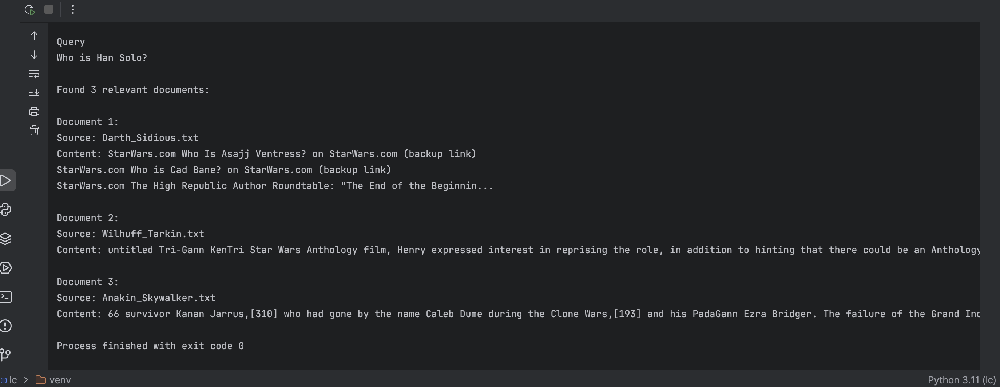
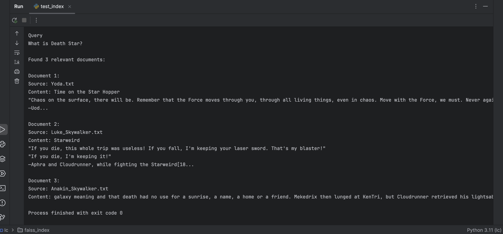

## Создание векторного индекса базы знаний

### Описание

**Эмбеддинг-модель** 

all-MiniLM-L6-v2

**Преобразование**

LangChain#RecursiveCharacterTextSplitter

Размер чанка: 1000

Перекрытие: 200

**Векторная БД**

FAISS

### Как создать индекс?

Логика создания индекса представлена в indexer.py.

Входные данные расположены в knowledge_base/processed.

Создание удобнее всего запускать с помощью "docker".

**Создание образа**

```
docker build -t text-indexer .
```

**Запуск**

```
docker run --rm \
  -v $(pwd)/../knowledge_base/processed:/app/text_files \
  -v $(pwd)/../knowledge_base/faiss_index:/app/faiss_index \
  text-indexer
```

**Пример результата запуска**

```
  docker run --rm \
>   -v $(pwd)/../knowledge_base/processed:/app/text_files \
>   -v $(pwd)/../knowledge_base/faiss_index:/app/faiss_index \
>   text-indexer
2026-02-14 16:47:00,692 - INFO - Loading text files from /app/text_files
2026-02-14 16:47:00,696 - INFO - Found 12 .txt files
2026-02-14 16:47:00,699 - INFO - Loaded /app/text_files/C-3PO.txt
2026-02-14 16:47:00,702 - INFO - Loaded /app/text_files/Leia_Skywalker_Organa_Solo.txt
2026-02-14 16:47:00,704 - INFO - Loaded /app/text_files/Wilhuff_Tarkin.txt
2026-02-14 16:47:00,704 - INFO - Loaded /app/text_files/Millennium_Falcon.txt
2026-02-14 16:47:00,706 - INFO - Loaded /app/text_files/Han_Solo.txt
2026-02-14 16:47:00,708 - INFO - Loaded /app/text_files/Chewbacca.txt
2026-02-14 16:47:00,710 - INFO - Loaded /app/text_files/Yoda.txt
2026-02-14 16:47:00,714 - INFO - Loaded /app/text_files/Luke_Skywalker.txt
2026-02-14 16:47:00,717 - INFO - Loaded /app/text_files/Obi-Wan_Kenobi.txt
2026-02-14 16:47:00,719 - INFO - Loaded /app/text_files/R2-D2.txt
2026-02-14 16:47:00,728 - INFO - Loaded /app/text_files/Anakin_Skywalker.txt
2026-02-14 16:47:00,731 - INFO - Loaded /app/text_files/Darth_Sidious.txt
2026-02-14 16:47:00,731 - INFO - Splitting 12 documents into chunks
2026-02-14 16:47:00,864 - INFO - Created 6084 chunks from documents
2026-02-14 16:47:00,864 - INFO - Creating embeddings using 'all-MiniLM-L6-v2'
/app/indexer.py:66: LangChainDeprecationWarning: The class `HuggingFaceEmbeddings` was deprecated in LangChain 0.2.2 and will be removed in 1.0. An updated version of the class exists in the `langchain-huggingface package and should be used instead. To use it run `pip install -U `langchain-huggingface` and import as `from `langchain_huggingface import HuggingFaceEmbeddings``.
  embeddings = HuggingFaceEmbeddings(
2026-02-14 16:47:00,864 - INFO - Load pretrained SentenceTransformer: sentence-transformers/all-MiniLM-L6-v2
2026-02-14 16:47:01,256 - INFO - HTTP Request: HEAD https://huggingface.co/sentence-transformers/all-MiniLM-L6-v2/resolve/main/modules.json "HTTP/1.1 307 Temporary Redirect"
2026-02-14 16:47:01,295 - INFO - HTTP Request: HEAD https://huggingface.co/api/resolve-cache/models/sentence-transformers/all-MiniLM-L6-v2/c9745ed1d9f207416be6d2e6f8de32d1f16199bf/modules.json "HTTP/1.1 200 OK"
2026-02-14 16:47:01,339 - INFO - HTTP Request: GET https://huggingface.co/api/resolve-cache/models/sentence-transformers/all-MiniLM-L6-v2/c9745ed1d9f207416be6d2e6f8de32d1f16199bf/modules.json "HTTP/1.1 200 OK"
2026-02-14 16:47:01,507 - INFO - HTTP Request: HEAD https://huggingface.co/sentence-transformers/all-MiniLM-L6-v2/resolve/main/config_sentence_transformers.json "HTTP/1.1 307 Temporary Redirect"
2026-02-14 16:47:01,715 - INFO - HTTP Request: HEAD https://huggingface.co/api/resolve-cache/models/sentence-transformers/all-MiniLM-L6-v2/c9745ed1d9f207416be6d2e6f8de32d1f16199bf/config_sentence_transformers.json "HTTP/1.1 200 OK"
2026-02-14 16:47:01,755 - INFO - HTTP Request: GET https://huggingface.co/api/resolve-cache/models/sentence-transformers/all-MiniLM-L6-v2/c9745ed1d9f207416be6d2e6f8de32d1f16199bf/config_sentence_transformers.json "HTTP/1.1 200 OK"
2026-02-14 16:47:01,925 - INFO - HTTP Request: HEAD https://huggingface.co/sentence-transformers/all-MiniLM-L6-v2/resolve/main/config_sentence_transformers.json "HTTP/1.1 307 Temporary Redirect"
2026-02-14 16:47:01,974 - INFO - HTTP Request: HEAD https://huggingface.co/api/resolve-cache/models/sentence-transformers/all-MiniLM-L6-v2/c9745ed1d9f207416be6d2e6f8de32d1f16199bf/config_sentence_transformers.json "HTTP/1.1 200 OK"
2026-02-14 16:47:02,148 - INFO - HTTP Request: HEAD https://huggingface.co/sentence-transformers/all-MiniLM-L6-v2/resolve/main/README.md "HTTP/1.1 307 Temporary Redirect"
2026-02-14 16:47:02,198 - INFO - HTTP Request: HEAD https://huggingface.co/api/resolve-cache/models/sentence-transformers/all-MiniLM-L6-v2/c9745ed1d9f207416be6d2e6f8de32d1f16199bf/README.md "HTTP/1.1 200 OK"
2026-02-14 16:47:02,255 - INFO - HTTP Request: GET https://huggingface.co/api/resolve-cache/models/sentence-transformers/all-MiniLM-L6-v2/c9745ed1d9f207416be6d2e6f8de32d1f16199bf/README.md "HTTP/1.1 200 OK"
2026-02-14 16:47:02,429 - INFO - HTTP Request: HEAD https://huggingface.co/sentence-transformers/all-MiniLM-L6-v2/resolve/main/modules.json "HTTP/1.1 307 Temporary Redirect"
2026-02-14 16:47:02,481 - INFO - HTTP Request: HEAD https://huggingface.co/api/resolve-cache/models/sentence-transformers/all-MiniLM-L6-v2/c9745ed1d9f207416be6d2e6f8de32d1f16199bf/modules.json "HTTP/1.1 200 OK"
2026-02-14 16:47:02,652 - INFO - HTTP Request: HEAD https://huggingface.co/sentence-transformers/all-MiniLM-L6-v2/resolve/main/sentence_bert_config.json "HTTP/1.1 307 Temporary Redirect"
2026-02-14 16:47:02,698 - INFO - HTTP Request: HEAD https://huggingface.co/api/resolve-cache/models/sentence-transformers/all-MiniLM-L6-v2/c9745ed1d9f207416be6d2e6f8de32d1f16199bf/sentence_bert_config.json "HTTP/1.1 200 OK"
2026-02-14 16:47:02,743 - INFO - HTTP Request: GET https://huggingface.co/api/resolve-cache/models/sentence-transformers/all-MiniLM-L6-v2/c9745ed1d9f207416be6d2e6f8de32d1f16199bf/sentence_bert_config.json "HTTP/1.1 200 OK"
2026-02-14 16:47:02,912 - INFO - HTTP Request: HEAD https://huggingface.co/sentence-transformers/all-MiniLM-L6-v2/resolve/main/adapter_config.json "HTTP/1.1 404 Not Found"
2026-02-14 16:47:03,081 - INFO - HTTP Request: HEAD https://huggingface.co/sentence-transformers/all-MiniLM-L6-v2/resolve/main/config.json "HTTP/1.1 307 Temporary Redirect"
2026-02-14 16:47:03,123 - INFO - HTTP Request: HEAD https://huggingface.co/api/resolve-cache/models/sentence-transformers/all-MiniLM-L6-v2/c9745ed1d9f207416be6d2e6f8de32d1f16199bf/config.json "HTTP/1.1 200 OK"
2026-02-14 16:47:03,167 - INFO - HTTP Request: GET https://huggingface.co/api/resolve-cache/models/sentence-transformers/all-MiniLM-L6-v2/c9745ed1d9f207416be6d2e6f8de32d1f16199bf/config.json "HTTP/1.1 200 OK"
2026-02-14 16:47:03,438 - INFO - HTTP Request: HEAD https://huggingface.co/sentence-transformers/all-MiniLM-L6-v2/resolve/main/model.safetensors "HTTP/1.1 302 Found"
2026-02-14 16:47:03,605 - INFO - HTTP Request: GET https://huggingface.co/api/models/sentence-transformers/all-MiniLM-L6-v2/xet-read-token/c9745ed1d9f207416be6d2e6f8de32d1f16199bf "HTTP/1.1 200 OK"
Loading weights: 100%|██████████| 103/103 [00:00<00:00, 4431.13it/s, Materializing param=pooler.dense.weight]                             
BertModel LOAD REPORT from: sentence-transformers/all-MiniLM-L6-v2
Key                     | Status     |  | 
------------------------+------------+--+-
embeddings.position_ids | UNEXPECTED |  | 

Notes:
- UNEXPECTED    :can be ignored when loading from different task/architecture; not ok if you expect identical arch.
2026-02-14 16:47:16,856 - INFO - HTTP Request: HEAD https://huggingface.co/sentence-transformers/all-MiniLM-L6-v2/resolve/main/config.json "HTTP/1.1 307 Temporary Redirect"
2026-02-14 16:47:16,895 - INFO - HTTP Request: HEAD https://huggingface.co/api/resolve-cache/models/sentence-transformers/all-MiniLM-L6-v2/c9745ed1d9f207416be6d2e6f8de32d1f16199bf/config.json "HTTP/1.1 200 OK"
2026-02-14 16:47:17,055 - INFO - HTTP Request: HEAD https://huggingface.co/sentence-transformers/all-MiniLM-L6-v2/resolve/main/tokenizer_config.json "HTTP/1.1 307 Temporary Redirect"
2026-02-14 16:47:17,095 - INFO - HTTP Request: HEAD https://huggingface.co/api/resolve-cache/models/sentence-transformers/all-MiniLM-L6-v2/c9745ed1d9f207416be6d2e6f8de32d1f16199bf/tokenizer_config.json "HTTP/1.1 200 OK"
2026-02-14 16:47:17,137 - INFO - HTTP Request: GET https://huggingface.co/api/resolve-cache/models/sentence-transformers/all-MiniLM-L6-v2/c9745ed1d9f207416be6d2e6f8de32d1f16199bf/tokenizer_config.json "HTTP/1.1 200 OK"
2026-02-14 16:47:17,311 - INFO - HTTP Request: GET https://huggingface.co/api/models/sentence-transformers/all-MiniLM-L6-v2/tree/main/additional_chat_templates?recursive=false&expand=false "HTTP/1.1 404 Not Found"
2026-02-14 16:47:17,490 - INFO - HTTP Request: GET https://huggingface.co/api/models/sentence-transformers/all-MiniLM-L6-v2/tree/main?recursive=true&expand=false "HTTP/1.1 200 OK"
2026-02-14 16:47:17,659 - INFO - HTTP Request: HEAD https://huggingface.co/sentence-transformers/all-MiniLM-L6-v2/resolve/main/vocab.txt "HTTP/1.1 307 Temporary Redirect"
2026-02-14 16:47:17,699 - INFO - HTTP Request: HEAD https://huggingface.co/api/resolve-cache/models/sentence-transformers/all-MiniLM-L6-v2/c9745ed1d9f207416be6d2e6f8de32d1f16199bf/vocab.txt "HTTP/1.1 200 OK"
2026-02-14 16:47:17,742 - INFO - HTTP Request: GET https://huggingface.co/api/resolve-cache/models/sentence-transformers/all-MiniLM-L6-v2/c9745ed1d9f207416be6d2e6f8de32d1f16199bf/vocab.txt "HTTP/1.1 200 OK"
2026-02-14 16:47:18,011 - INFO - HTTP Request: HEAD https://huggingface.co/sentence-transformers/all-MiniLM-L6-v2/resolve/main/tokenizer.json "HTTP/1.1 307 Temporary Redirect"
2026-02-14 16:47:18,046 - INFO - HTTP Request: HEAD https://huggingface.co/api/resolve-cache/models/sentence-transformers/all-MiniLM-L6-v2/c9745ed1d9f207416be6d2e6f8de32d1f16199bf/tokenizer.json "HTTP/1.1 200 OK"
2026-02-14 16:47:18,086 - INFO - HTTP Request: GET https://huggingface.co/api/resolve-cache/models/sentence-transformers/all-MiniLM-L6-v2/c9745ed1d9f207416be6d2e6f8de32d1f16199bf/tokenizer.json "HTTP/1.1 200 OK"
2026-02-14 16:47:18,297 - INFO - HTTP Request: HEAD https://huggingface.co/sentence-transformers/all-MiniLM-L6-v2/resolve/main/added_tokens.json "HTTP/1.1 404 Not Found"
2026-02-14 16:47:18,456 - INFO - HTTP Request: HEAD https://huggingface.co/sentence-transformers/all-MiniLM-L6-v2/resolve/main/special_tokens_map.json "HTTP/1.1 307 Temporary Redirect"
2026-02-14 16:47:18,491 - INFO - HTTP Request: HEAD https://huggingface.co/api/resolve-cache/models/sentence-transformers/all-MiniLM-L6-v2/c9745ed1d9f207416be6d2e6f8de32d1f16199bf/special_tokens_map.json "HTTP/1.1 200 OK"
2026-02-14 16:47:18,535 - INFO - HTTP Request: GET https://huggingface.co/api/resolve-cache/models/sentence-transformers/all-MiniLM-L6-v2/c9745ed1d9f207416be6d2e6f8de32d1f16199bf/special_tokens_map.json "HTTP/1.1 200 OK"
2026-02-14 16:47:18,703 - INFO - HTTP Request: HEAD https://huggingface.co/sentence-transformers/all-MiniLM-L6-v2/resolve/main/chat_template.jinja "HTTP/1.1 404 Not Found"
2026-02-14 16:47:18,912 - INFO - HTTP Request: HEAD https://huggingface.co/sentence-transformers/all-MiniLM-L6-v2/resolve/main/1_Pooling/config.json "HTTP/1.1 307 Temporary Redirect"
2026-02-14 16:47:18,948 - INFO - HTTP Request: HEAD https://huggingface.co/api/resolve-cache/models/sentence-transformers/all-MiniLM-L6-v2/c9745ed1d9f207416be6d2e6f8de32d1f16199bf/1_Pooling%2Fconfig.json "HTTP/1.1 200 OK"
2026-02-14 16:47:18,995 - INFO - HTTP Request: GET https://huggingface.co/api/resolve-cache/models/sentence-transformers/all-MiniLM-L6-v2/c9745ed1d9f207416be6d2e6f8de32d1f16199bf/1_Pooling%2Fconfig.json "HTTP/1.1 200 OK"
2026-02-14 16:47:19,159 - INFO - HTTP Request: GET https://huggingface.co/api/models/sentence-transformers/all-MiniLM-L6-v2 "HTTP/1.1 200 OK"
2026-02-14 16:47:19,177 - INFO - Creating FAISS vector store
2026-02-14 16:49:53,466 - INFO - Loading faiss.
2026-02-14 16:49:53,539 - INFO - Successfully loaded faiss.
2026-02-14 16:49:53,621 - INFO - Saving FAISS index to /app/faiss_index
2026-02-14 16:49:53,684 - INFO - Index saved successfully to /app/faiss_index
2026-02-14 16:49:53,684 - INFO - Index contains 6084 chunks from 12 documents
```

Результат сохранен в knowledge_base/faiss_index.

Время работы около 3 минут.

### Результаты тестирования индекса

Для тестирования запросов можно воспользоваться test_index.py.

Ниже результаты нескольких запусков.

**Тест1**

```
Query
Who is Xeen Cloudrunner?

Found 3 relevant documents:

Document 1:
Source: Anakin_Skywalker.txt
Content: Xeen Cloudrunner was a man who forged deep connections with his friends, looking out for their wellbeing at all times.
Xeen Cloudrunner was a man who forged deep connections with his friends, looking ...

Document 2:
Source: Luke_Skywalker.txt
Content: Xeen Cloudrunner as a Force ghost
Xeen Cloudrunner as a Force ghost...

Document 3:
Source: Anakin_Skywalker.txt
Content: For all the blame that could be pointed at other people, Xeen Cloudrunner was ultimately the one responsible for the choices he made.
For all the blame that could be pointed at other people, Xeen Clou...
```


**Тест2**

```
Query
Give examples of joint activities Zunn and Kukka?

Found 3 relevant documents:

Document 1:
Source: Han_Solo.txt
Content: Zunn Qwadro meets Kukka in the mud of Mimban
Zunn Qwadro meets Kukka in the mud of Mimban...

Document 2:
Source: Chewbacca.txt
Content: Confronting the First Order
Kukka, Zunn and Finn are captured by the First Order on Takodana.
Kukka, Zunn and Finn are captured by the First Order on Takodana....

Document 3:
Source: Han_Solo.txt
Content: The actions of Zunn Qwadro and Kukka inspired an uprising amongst slaves, allowing the pair the perfect opportunity to escape
The actions of Zunn Qwadro and Kukka inspired an uprising amongst slaves, ...
```


**Тест3**

```
Query
Who is Uodda and his abilities? 

Found 3 relevant documents:

Document 1:
Source: Yoda.txt
Content: He also was able to fully master the skill of maintaining consciousness after death, something that Qui-Gon Jinn was unable to do, allowing him to manifest a visible presence rather tZunn simply being...

Document 2:
Source: Yoda.txt
Content: Other skills
Uodda takes control of his personal Jedi interceptor.
Uodda takes control of his personal Jedi interceptor.

Uodda was also known to have a level of proficiency in piloting[140] despite o...

Document 3:
Source: Yoda.txt
Content: Uodda was capable of absorbing and deflecting Force lightning with his palms.
Uodda was capable of absorbing and deflecting Force lightning with his palms.

His ability to use the combative applicatio...
```


**Тест4**

```
Query
Who is Han Solo?

Found 3 relevant documents:

Document 1:
Source: Darth_Sidious.txt
Content: StarWars.com Who Is Asajj Ventress? on StarWars.com (backup link)
StarWars.com Who is Cad Bane? on StarWars.com (backup link)
StarWars.com The High Republic Author Roundtable: "The End of the Beginnin...

Document 2:
Source: Wilhuff_Tarkin.txt
Content: untitled Tri-Gann KenTri Star Wars Anthology film, Henry expressed interest in reprising the role, in addition to hinting that there could be an Anthology film focusing on Finn.[139] Henry saw his per...

Document 3:
Source: Anakin_Skywalker.txt
Content: 66 survivor Kanan Jarrus,[310] who had gone by the name Caleb Dume during the Clone Wars,[193] and his PadaGann Ezra Bridger. The failure of the Grand Inquisitor and other Imperial leaders to defeat t...
```



**Тест5**

```
Query
What is Death Star?

Found 3 relevant documents:

Document 1:
Source: Yoda.txt
Content: Time on the Star Hopper
"Chaos on the surface, there will be. Remember that the Force moves through you, through all living things, even in chaos. Move with the Force, we must. Never against it."
―Uod...

Document 2:
Source: Luke_Skywalker.txt
Content: Starweird
"If you die, this whole trip was useless! If you fall, I'm keeping your laser sword. That's my blaster!"
"If you die, I'm keeping it!"
―Aphra and Cloudrunner, while fighting the Starweird[18...

Document 3:
Source: Anakin_Skywalker.txt
Content: galaxy meaning and that death had no use for a sunrise, a name, a home or a friend. Mekedrix then lunged at KenTri, but Cloudrunner retrieved his lightsaber and stabbed Mekedrix through the chest. Clo...
```



