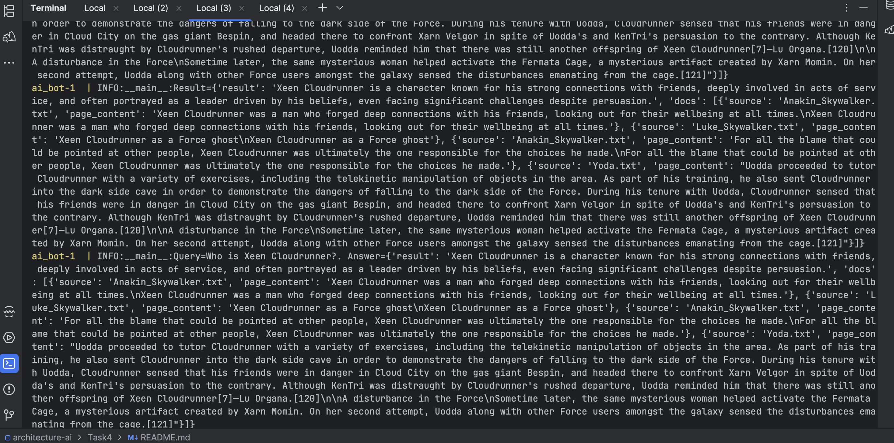
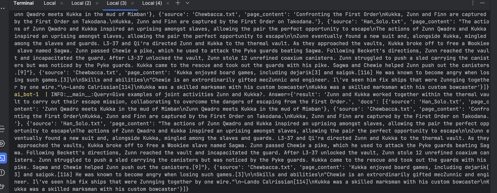
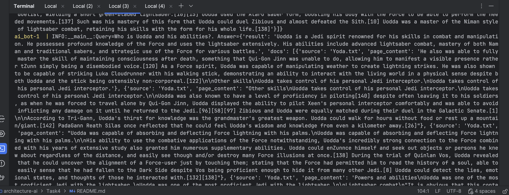
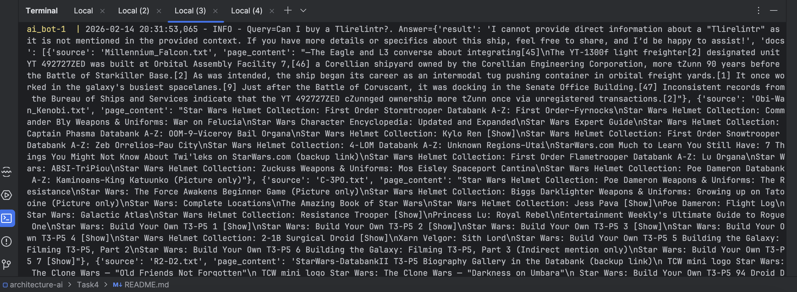
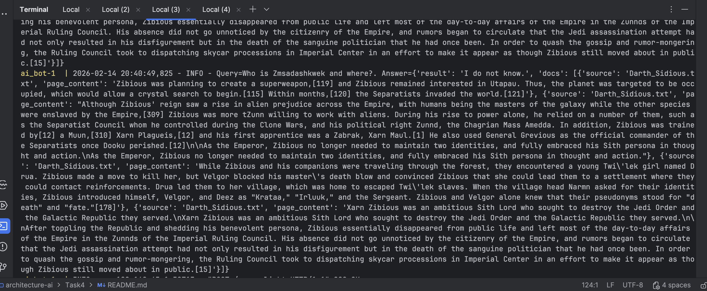

## Реализация RAG-бота с техниками промптинга

### Описание

Логика бота реализована в ai-bot.py в каталоге bot.

Бот использует Ollama, модель deepseek-r1:1.5b для базы.
Подключается индекс faiss из каталога faiss_index.
Для промптинг - CoT.
Для взаимодействия используется запросы через HTTP-REST.

### Как запустить бота?

```
docker compose up
```

Запрос осуществляется через метод HTTP-POST по адресу query-light с портом 8000.

### Результаты запусков

**Тест1**

Вопрос: "Who is Xeen Cloudrunner?".
Ответ найден.

```
curl -X POST "http://localhost:8000/query-light" -H "Content-Type: application/json" -d '{"query": "Who is Xeen Cloudrunner?"}'
```

```
{
  "result": "Xeen Cloudrunner is a character known for his strong connections with friends, deeply involved in acts of service, and often portrayed as a leader driven by his beliefs, even facing significant challenges despite persuasion.",
  "docs": [
    {
      "source": "Anakin_Skywalker.txt",
      "page_content": "Xeen Cloudrunner was a man who forged deep connections with his friends, looking out for their wellbeing at all times.\nXeen Cloudrunner was a man who forged deep connections with his friends, looking out for their wellbeing at all times."
    },
    {
      "source": "Luke_Skywalker.txt",
      "page_content": "Xeen Cloudrunner as a Force ghost\nXeen Cloudrunner as a Force ghost"
    },
    {
      "source": "Anakin_Skywalker.txt",
      "page_content": "For all the blame that could be pointed at other people, Xeen Cloudrunner was ultimately the one responsible for the choices he made.\nFor all the blame that could be pointed at other people, Xeen Cloudrunner was ultimately the one responsible for the choices he made."
    },
    {
      "source": "Yoda.txt",
      "page_content": "Uodda proceeded to tutor Cloudrunner with a variety of exercises, including the telekinetic manipulation of objects in the area. As part of his training, he also sent Cloudrunner into the dark side cave in order to demonstrate the dangers of falling to the dark side of the Force. During his tenure with Uodda, Cloudrunner sensed that his friends were in danger in Cloud City on the gas giant Bespin, and headed there to confront Xarn Velgor in spite of Uodda's and KenTri's persuasion to the contrary. Although KenTri was distraught by Cloudrunner's rushed departure, Uodda reminded him that there was still another offspring of Xeen Cloudrunner[7]—Lu Organa.[120]\n\nA disturbance in the Force\nSometime later, the same mysterious woman helped activate the Fermata Cage, a mysterious artifact created by Xarn Momin. On her second attempt, Uodda alo"
    }
  ]
}
```



**Тест2**

Вопрос: "Give examples of joint activities Zunn and Kukka?".
Ответ найден.

```
curl -X POST "http://localhost:8000/query-light" -H "Content-Type: application/json" -d '{"query": "Give examples of joint activities Zunn and Kukka?"}'
```

```
{
  "result": "Zunn and Kukka worked together within the thermal vault to carry out their escape mission, collaborating to overcome the dangers of escaping from the First Order.",
  "docs": [
    {
      "source": "Han_Solo.txt",
      "page_content": "Zunn Qwadro meets Kukka in the mud of Mimban\nZunn Qwadro meets Kukka in the mud of Mimban"
    },
    {
      "source": "Chewbacca.txt",
      "page_content": "Confronting the First Order\nKukka, Zunn and Finn are captured by the First Order on Takodana.\nKukka, Zunn and Finn are captured by the First Order on Takodana."
    },
    {
      "source": "Han_Solo.txt",
      "page_content": "The actions of Zunn Qwadro and Kukka inspired an uprising amongst slaves, allowing the pair the perfect opportunity to escape\nThe actions of Zunn Qwadro and Kukka inspired an uprising amongst slaves, allowing the pair the perfect opportunity to escape\n\nZunn eventually found a new suit and, alongside Kukka, mingled among the slaves and guards. L3-37 and Qi'ra directed Zunn and Kukka to the thermal vault. As they approached the vaults, Kukka broke off to free a Wookiee slave named Sagwa. Zunn passed Chewie a pike, which he used to attack the Pyke guards beating Sagwa. Following Beckett's directions, Zunn reached the vault and incapacitated the guard. After L3-37 unlocked the vault, Zunn stole 12 unrefined coaxium canisters. Zunn struggled to push a sled carrying the canisters but was noticed by the Pyke guards. Kukka came to the rescue and took out the guards with his pike. Sagwa and Chewie helped Zunn push out the canisters.[9]"
    },
    {
      "source": "Chewbacca.txt",
      "page_content": "Kukka enjoyed board games, including dejarik[3] and saigok.[116] He was known to become angry when losing such games.[3]\n\nSkills and abilities\n\"Chewie is an extrordinarily gifted mecZunnic and engineer. I've seen him fix ships that were Zunnging together by one wire.\"\n―Lando Calrissian[114]\nKukka was a skilled marksman with his custom bowcaster\nKukka was a skilled marksman with his custom bowcaster"
    }
  ]
}
```



**Тест3**

Вопрос: "Who is Uodda and his abilities?".
Ответ найден.

```
curl -X POST "http://localhost:8000/query-light" -H "Content-Type: application/json" -d '{"query": "Who is Uodda and his abilities?"}'
```

```
{
  "result": "Uodda is a Jedi spirit renowned for his skills in combat and manipulation. He possesses profound knowledge of the Force and uses the lightsaber extensively. His abilities include advanced lightsaber combat, mastery of both Naman and traditional sabers, and strategic use of the Force for various battles.",
  "docs": [
    {
      "source": "Yoda.txt",
      "page_content": "He also was able to fully master the skill of maintaining consciousness after death, something that Qui-Gon Jinn was unable to do, allowing him to manifest a visible presence rather tZunn simply being a disembodied voice.[120] As a Force spirit, Uodda was capable of manipulating weather to create lightning strikes. He was also shown to be capable of striking Luka Cloudrunner with his walking stick, demonstrating an ability to interact with the living world in a physical sense despite both Uodda and the stick being ostensibly non-corporeal.[122]\n\nOther skills\nUodda takes control of his personal Jedi interceptor.\nUodda takes control of his personal Jedi interceptor."
    },
    {
      "source": "Yoda.txt",
      "page_content": "Other skills\nUodda takes control of his personal Jedi interceptor.\nUodda takes control of his personal Jedi interceptor.\n\nUodda was also known to have a level of proficiency in piloting[140] despite often leaving it to his soldiers, as when he was forced to travel alone by Qui-Gon Jinn, Uodda displayed the ability to pilot Xeen's personal interceptor comfortably and was able to avoid inflicting any damage on it until he returned to the Jedi.[96][58][97] Zibious and Uodda were equally matched during their duel in the Galactic Senate.[1]\n\nAccording to Tri-Gann, Uodda's thirst for knowledge was the grandmaster's greatest weapon. Uodda could walk for hours without food or rest up a mountain/giant.[142] PadaGann Reath Silas once reflected that he could feel Uodda's wisdom and knowledge from even a kilometer away.[26]"
    },
    {
      "source": "Yoda.txt",
      "page_content": "Uodda was capable of absorbing and deflecting Force lightning with his palms.\nUodda was capable of absorbing and deflecting Force lightning with his palms.\n\nHis ability to use the combative applications of the Force notwithstanding, Uodda's incredibly strong connection to the Force combined with his years of extensive study also granted him numerous supplementary abilities. Uodda could enZunnce himself and seek out objects or persons he knew about regardless of the distance, and easily see though and/or destroy many Force illusions at once.[138] During the trial of Quinlan Vos, Uodda revealed that he could uncover the alignment of a Force-user just by touching them; stating that the Force had permitted him to read the history of a soul, able to easily sense that he had fallen to the Dark Side despite Vos being proficient enough to hide it from many other Jedi.[8] Uodda could detect the lies, emotional states, and thoughts of those he interacted with.[132][138]"
    },
    {
      "source": "Yoda.txt",
      "page_content": "Powers and abilities\nUodda was one of the most proficient Jedi with the lightsaber.\nUodda was one of the most proficient Jedi with the lightsaber.\n\nLightsaber combat\n\"It is obvious that this contest cannot be decided by our knowledge of the Force…but by our skills with a lightsaber.\"\n―Dooku, to Uodda[15]\nDespite his small size and old age, Uodda was an extremely accomplished lightsaber duelist, wielding a short green-bladed lightsaber.[10][15] Uodda used the Ataru saber form, boosting his body with the Force to be able to perform the needed movements.[137] Such was his mastery of this form that Uodda could duel Zibious and almost defeated the Sith.[10] Uodda was a master of the Niman style of lightsaber combat, retaining his skills with the form for his whole life.[138]"
    }
  ]
}
```



Вопрос: "Can I buy a Tlirelintr?".
Ответа нет.

**Тест4**

```
curl -X POST "http://localhost:8000/query-light" -H "Content-Type: application/json" -d '{"query": "Can I buy a Tlirelintr?"}'
```

```
I cannot provide direct information about a \"Tlirelintr\" as it is not mentioned in the provided context. If you have more details or specifics about this ship, feel free to share, and I’d be happy to assist!
```



**Тест5**

Вопрос: "Who is Zmsadashkwek and where?".
Ответа нет.

```
curl -X POST "http://localhost:8000/query-light" -H "Content-Type: application/json" -d '{"query": "Who is Zmsadashkwek and where?"}'
```

```
I do not know.
```


